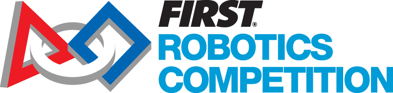
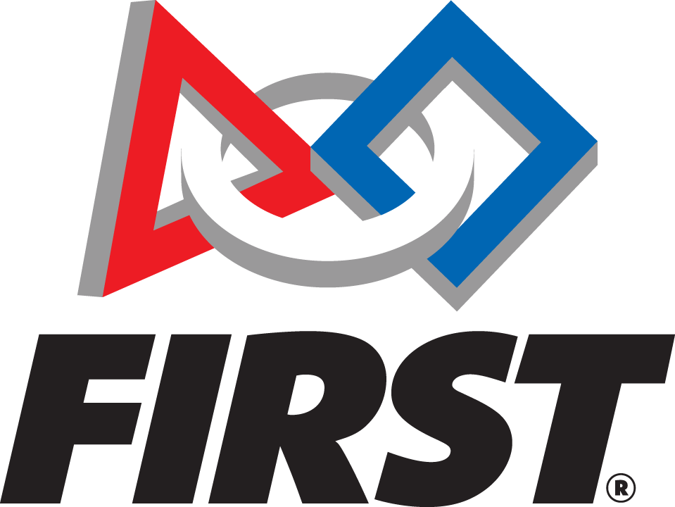
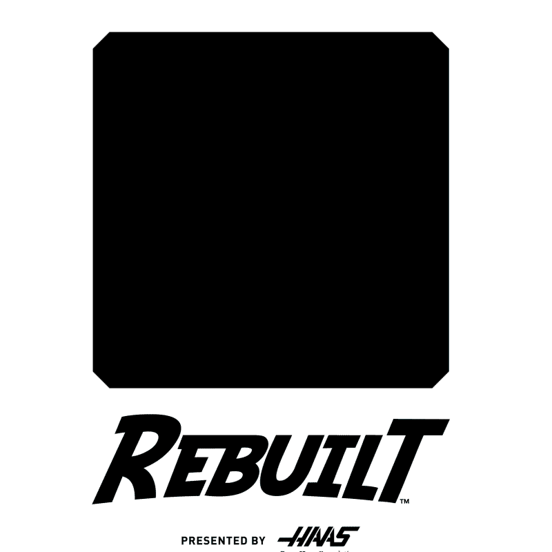

<table>
<tr>
<td align="center" width="33%">

 <b>Uygulama ikonu</b>
</td>
<td align="center" width="33%">

 <b>FRC / FIRST Robotics Competition</b>
</td>
<td align="center" width="33%">

 <b>FIRST dikey logo</b>
</td>
</tr>
</table>

# FRCLive

**Minimalist, temiz ve profesyonel bir iOS deneyimiyle FRC etkinliklerini takip edin.**

[The Blue Alliance](https://www.thebluealliance.com) ile takım profili, etkinlikler, maç programı, sıralama ve ödüller; [FRC Nexus](https://frc.nexus/) ile canlı sıra, sıradaki maç ve sahadaki maç bilgisini tek uygulamada birleştirin.

 
Mevcut oyun görsellerinden <code>rebuilt.gif</code> — uygulama içi onboarding’de de kullanılır.

[**GitHub deposu**](https://github.com/OnurAkyuz61/FRCLive)

---

## İçindekiler

1. [Bu uygulama ne yapar?](#bu-uygulama-ne-yapar)
2. [Veri kaynakları ve API anahtarları](#veri-kaynakları-ve-api-anahtarları)
3. [Kurulum ve gereksinimler](#kurulum-ve-gereksinimler)
4. [İlk kullanım (adım adım)](#ilk-kullanım-adım-adım)
5. [Ana özellikler](#ana-özellikler)
6. [Widget’lar](#widgetlar)
7. [Canlı etkinlikler ve Dynamic Island](#canlı-etkinlikler-ve-dynamic-island)
8. [Bildirimler](#bildirimler)
9. [Demo modu](#demo-modu)
10. [Teknik mimari (özet)](#teknik-mimari-özet)
11. [Gizlilik ve güvenlik](#gizlilik-ve-güvenlik)
12. [Sorun giderme](#sorun-giderme)
13. [Lisans ve iletişim](#lisans-ve-iletişim)

---

## Bu uygulama ne yapar?

**FRCLive**, FIRST Robotics Competition (FRC) takımlarının seçtikleri bölgesel / şampiyona etkinliklerinde:

- **Maç takvimini ve sonuçları** (TBA),
- **Canlı sıra ve sıradaki maç** bilgisini (Nexus),

bir arada gösterir. Arayüz **Türkçe ve İngilizce** destekler; **açık / koyu tema** ile uyumludur.

---

## Veri kaynakları ve API anahtarları

Uygulama iki bağımsız API kullanır; her ikisi için de **kendi anahtarınızı** oluşturup onboarding ekranında onaylamanız gerekir.

### The Blue Alliance (TBA)

- **Ne için:** Takım bilgisi, 2026 etkinlik listesi, maçlar, sıralama, ödüller vb.
- **API anahtarı:** [The Blue Alliance — Hesap](https://www.thebluealliance.com/account) üzerinden giriş yapıp geliştirici / API bölümünden anahtarınızı alın.
- **Resmi site:** [thebluealliance.com](https://www.thebluealliance.com)

Uygulama isteklerde `X-TBA-Auth-Key` başlığını kullanır; anahtar **Keychain** içinde saklanır.

### FRC Nexus

- **Ne için:** Etkinlikteki canlı sıra tahtası: sıradaki maç, çağrılma durumu, sahada oynanan maç vb.
- **API:** Nexus dokümantasyonu ve anahtar yönetimi için: **[https://frc.nexus/tr-TR/api](https://frc.nexus/tr-TR/api)**  
  (İngilizce sayfa da mevcuttur; ihtiyacınıza göre dil seçebilirsiniz.)
- Nexus anahtarı uygulama içinde **UserDefaults** ile saklanır (bu projede kullanıcı tercihi doğrultusunda).

> **Not:** TBA etkinlik kodu ile Nexus etkinlik kodu bazen farklı olabilir (ör. `2026joh` vs `2026johnson`). Uygulama, Nexus tarafında etkinlik listesi ve seçilen etkinlik adına göre **doğru Nexus anahtarını** çözmeye çalışır.

---

## Kurulum ve gereksinimler

| Gereksinim | Açıklama |
|------------|----------|
| **macOS + Xcode** | SwiftUI ve Widget / Live Activity hedefleri için güncel Xcode önerilir. |
| **Apple Developer hesabı** | Gerçek cihazda bildirim, Live Activity ve App Group için geliştirici hesabı ve doğru provisioning. |
| **App Group** | Widget ve ana uygulama verisi için `group.onurakyuz.FRCLive` (hem ana hedef hem widget extension’da tanımlı olmalı). |

Depoyu klonladıktan sonra:

1. `FRCLive.xcodeproj` veya workspace’i Xcode ile açın.
2. **Signing & Capabilities** altında kendi takım kimliğinizi ve App Group’u doğrulayın.
3. Widget extension ve ana uygulamanın aynı App Group’u paylaştığından emin olun.

---

## İlk kullanım (adım adım)

1. **Takım numarası** girin (en fazla 5 hane).
2. **[The Blue Alliance hesabınızdan](https://www.thebluealliance.com/account)** aldığınız **TBA API anahtarını** yazıp **Onayla** deyin — sunucu doğrulaması yapılır.
3. **[Nexus API](https://frc.nexus/tr-TR/api)** üzerinden edindiğiniz **Nexus anahtarını** yazıp **Onayla** deyin.
4. **Devam Et** ile takımın **2026 etkinliklerini** listeleyin; bir etkinlik seçin (bitiş tarihine göre “tamamlandı” bilgisi gösterilir).
5. Ana uygulama açılır: **Panel**, **Takvim**, **Sıralama**, **Ayarlar** sekmeleri.

Dil için onboarding veya ayarlardan **TR / EN** seçebilirsiniz.

---

## Ana özellikler

| Sekme | Özet |
|--------|------|
| **Panel** | Nexus’tan canlı özet: sıradaki maç, sıra durumu, sahadaki maç, veri kaynağı göstergesi. Etkinlik tamamlandıysa canlı veri yerine uygun bilgilendirme. |
| **Takvim** | TBA’dan takımınızın maçları; pratik / eleme / playoff ayrımı; skor ve kazanma/kaybetme gösterimi. Nexus ile yaklaşan maçlar sayfasına geçiş. |
| **Sıralama** | TBA sıralama tablosu; kendi takımınız vurgulanır; ödüller sekmesi. |
| **Ayarlar** | Canlı etkinlikler, bildirimler, dil, tema, çıkış. |

---

## Widget’lar

Ana ekranda **küçük, orta ve büyük** widget’lar; **FRC Process Blue** (#009CD7) arka plan ve beyaz metin ile uyumludur.

- Gösterilen bilgiler App Group üzerinden **WidgetDataStore** ile senkronize edilir: takım, etkinlik adı, sıradaki maç, sıra durumu, sahadaki maç, güncelleme zamanı.
- Dil, uygulamadaki `appLanguage` ile widget’a yazılır (TR/EN).

Widget’ın güncellenmesi için uygulamayı bir süre açıp tutmak veya sistem zamanlamasına güvenmek gerekir; iOS widget’ları anlık push ile sürekli çalışmaz.

---

## Canlı etkinlikler ve Dynamic Island

**ActivityKit** ile kilit ekranı ve **Dynamic Island**’da canlı özet gösterilir:

- Takım ve etkinlik bağlamı,
- Sıradaki maç (kompakt görünümde kısaltılmış etiketler),
- Sıra durumu ve sahada oynanan maç.

Live Activity güncellemeleri uygulama içi polling ile uyumludur; dil değişince anahtarlar güncellenir. Çıkış yapıldığında veya takım / etkinlik temizlendiğinde aktivite sonlandırılır.

---

## Bildirimler

Ayarlar’dan bildirim izni verildiğinde, sıra durumu **çağrıldı / sahada** gibi önemli anlarda yerel bildirim tetiklenebilir (tekrar spam’ini önlemek için anahtar saklama kullanılır).

---

## Demo modu

**Takım numarası `99999`** girildiğinde TBA ve Nexus için örnek veriler kullanılır; arayüzü ve widget / Live Activity davranışını risk almadan denemek içindir.

---

## Teknik mimari (özet)

| Konu | Detay |
|------|--------|
| **UI** | SwiftUI, `NavigationStack`, `TabView`, yerelleştirme `L10n` / `AppLanguage`. |
| **Ağ** | `URLSession`, `async/await`; TBA ve Nexus için ayrı istemci sınıfları. |
| **Veri modelleri** | `Codable` ile TBA yanıtları; Nexus için esnek JSON ayrıştırma. |
| **Widget** | WidgetKit, `TimelineProvider`, App Group `UserDefaults`. |
| **Live Activity** | ActivityKit, paylaşılan `ActivityAttributes` yapısı widget extension ile. |
| **Güvenlik** | TBA anahtarı Keychain; Nexus anahtarı UserDefaults (proje tercihi). |

---

## Gizlilik ve güvenlik

- **TBA API anahtarı** cihazda Keychain ile saklanır.
- **Nexus API anahtarı** UserDefaults’ta tutulur; hassas veri için ek şifreleme ihtiyacını değerlendirebilirsiniz.
- Kişisel hesap bilgisi uygulama sunucusuna gönderilmez; istekler doğrudan TBA ve Nexus uç noktalarına gider.

---

## Sorun giderme

| Sorun | Öneri |
|--------|--------|
| Widget eski veri gösteriyor | Uygulamayı açıp panelde güncel verinin gelmesini bekleyin; gerekirse widget’ı kaldırıp yeniden ekleyin. |
| Nexus verisi yok | Etkinlik kodunun Nexus’ta mevcut olduğundan ve anahtarın geçerli olduğundan emin olun; `frc.nexus` dokümantasyonuna bakın. |
| TBA 401 | Anahtarı [TBA hesap](https://www.thebluealliance.com/account) sayfasından yenileyin. |
| Live Activity takılı kaldı | Ayarlardan çıkış veya canlı etkinlikleri kapatıp tekrar açmayı deneyin. |

---

## Lisans ve iletişim

- Lisans dosyası depodaki **LICENSE** ile uyumludur (MIT).
- Geliştirici: **Onur Akyüz** — [onurakyuz.com](https://onurakyuz.com)

---

FIRST®, FIRST Robotics Competition ve ilgili logolar FIRST’ın tescilli markalarıdır. Bu proje FIRST tarafından resmi olarak onaylanmış bir ürün değildir.

